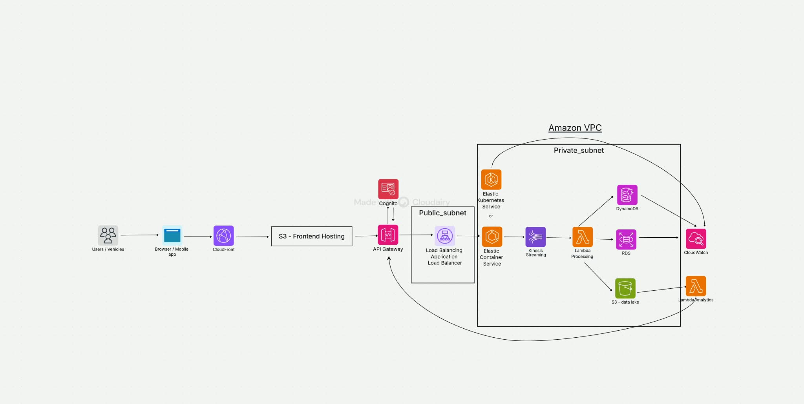

# UrbanMove – Cloud Native Smart Mobility Platform

> Final Project · Cloud Architecture · AWS · Fleet Supervision Dashboard

[](./architecture.png)

---

## 🚀 Quick Start (Local Development)

### Prerequisites

| Tool | Version |
|---|---|
| Docker & Docker Compose | ≥ 24 |
| Node.js | ≥ 20 |
| npm | ≥ 10 |

### 1. Start all services

```bash
# Make LocalStack init script executable
chmod +x infra/localstack/init-aws.sh

# Start everything
docker-compose up --build
```

Services started:
| Service | URL |
|---|---|
| **Frontend** (Vite) | http://localhost:5173 |
| **Backend API** | http://localhost:3000 |
| **LocalStack** (AWS) | http://localhost:4566 |

### 2. Demo credentials

| Role | Email | Password |
|---|---|---|
| Admin | admin@urbanmove.io | Admin@123 |
| Operator | operator@urbanmove.io | Operator@123 |
| Viewer | viewer@urbanmove.io | Viewer@123 |

---

## 🏗️ Architecture

```
Users/Vehicles
     │
     ▼
CloudFront ──── S3 (Frontend)
     │
     ▼
API Gateway (Cognito JWT Auth)
     │
     ▼ (VPC Link)
┌────────────── Amazon VPC ────────────────────────┐
│  ┌─── Public Subnet ───────────────────────────┐ │
│  │         Application Load Balancer           │ │
│  └─────────────────────────────────────────────┘ │
│                        │                          │
│  ┌─── Private Subnet ──┼──────────────────────┐ │
│  │    ECS Fargate (Node.js API)                │ │
│  │          │                                  │ │
│  │    Kinesis Stream → Lambda Processor        │ │
│  │          │                                  │ │
│  │    DynamoDB (Vehicles, Telemetry,           │ │
│  │             Routes, Alerts)                 │ │
│  │                                             │ │
│  │    Lambda Analytics → S3 Data Lake          │ │
│  └─────────────────────────────────────────────┘ │
│                                                   │
│    CloudWatch (Dashboards + Alarms)               │
└───────────────────────────────────────────────────┘
```

---

## 📁 Project Structure

```
fleet-tracking/
├── frontend/          # React + Vite (TypeScript)
│   ├── src/
│   │   ├── pages/     # Dashboard, Vehicles, Routes, Analytics, Alerts, Auth
│   │   ├── components/# Layout, Sidebar
│   │   ├── store/     # Zustand auth store
│   │   └── services/  # Axios API client
│   └── Dockerfile
│
├── backend/           # Node.js Express API
│   ├── src/
│   │   ├── routes/    # auth, vehicles, telemetry, routes, alerts, analytics
│   │   ├── middleware/# JWT authentication, rate limiter
│   │   └── services/  # DynamoDB, Kinesis
│   └── Dockerfile
│
├── infra/
│   ├── terraform/     # AWS infrastructure as code
│   │   ├── vpc.tf         VPC, subnets, NAT GW, security groups
│   │   ├── ecs.tf         ECS Fargate cluster + auto-scaling
│   │   ├── alb.tf         Application Load Balancer
│   │   ├── api_gateway.tf HTTP API Gateway v2 + Cognito auth
│   │   ├── cognito.tf     User pool + groups (Admin/Operator/Viewer)
│   │   ├── dynamodb.tf    4 tables with GSIs
│   │   ├── kinesis.tf     Telemetry data stream
│   │   ├── lambda.tf      Processor + analytics Lambdas
│   │   ├── s3.tf          Frontend + data lake + CloudFront
│   │   └── cloudwatch.tf  Dashboard + alarms
│   └── localstack/
│       ├── init-aws.sh    Bootstrap script for local AWS simulation
│       └── simulator.js   GPS telemetry simulator (20 virtual vehicles)
│
└── lambda/
    ├── processor/     # Kinesis → DynamoDB batch processor
    └── analytics/     # Scheduled metrics aggregator
```

---

## 🛠️ Development — Running Individually

**Backend only:**
```bash
cd backend
cp .env.example .env   # edit as needed
npm run dev            # starts on :3000 with nodemon
```

**Frontend only:**
```bash
cd frontend
npm run dev            # starts on :5173 with Vite HMR
```

---

## ☁️ AWS Deployment (Terraform)

```bash
cd infra/terraform

# Initialize
terraform init

# Preview
terraform plan -var="container_image=<ECR_IMAGE_URI>"

# Deploy
terraform apply -var="container_image=<ECR_IMAGE_URI>"
```

After `apply`, outputs:
- `api_gateway_url` → HTTPS endpoint for the API
- `cloudfront_domain` → Frontend URL
- `cognito_user_pool_id` → For Cognito configuration

**Build and push backend image:**
```bash
# Login to ECR
aws ecr get-login-password | docker login --username AWS --password-stdin <account>.dkr.ecr.us-east-1.amazonaws.com

# Build + push
docker build -t urbanmove-api ./backend
docker tag urbanmove-api:latest <ecr-uri>:latest
docker push <ecr-uri>:latest
```

---

## 🔐 Security Design

| Layer | Mechanism |
|---|---|
| Authentication | AWS Cognito User Pools (JWT tokens) |
| Authorization | Role-based (Admin / Operator / Viewer) |
| API Protection | API Gateway JWT authorizer + throttling |
| Network | VPC with public/private subnets, NAT GW |
| Private connectivity | VPC Link (API GW → ALB), VPC Endpoints (DynamoDB, S3) |
| Data at rest | DynamoDB SSE-KMS, S3 default encryption |
| Data in transit | TLS everywhere (CloudFront, API GW) |
| Headers | Helmet.js (CSP, HSTS, etc.) |

---

## 📊 Functional Pages

| Page | Features |
|---|---|
| **Dashboard** | Live Leaflet map, KPI cards, real-time alerts sidebar, zone distribution |
| **Vehicles** | Fleet table with CRUD, search/filter, fuel gauge, status badges |
| **Routes** | Route planner with map, 3 AI-recommended routes, save/assign to vehicle |
| **Analytics** | Utilization gauge, congestion heatmap per zone, speed trends chart, hourly activity |
| **Alerts** | Real-time alert feed, acknowledge/resolve, severity filter, create alert modal |

---

## 📦 Tech Stack

| Layer | Technology |
|---|---|
| Frontend | React 19, Vite 6, TypeScript, Zustand, TanStack Query, Leaflet, Recharts |
| Backend | Node.js 20, Express 5, AWS SDK v3 |
| Database | Amazon DynamoDB (on-demand) |
| Auth | AWS Cognito (JWT) |
| Streaming | Amazon Kinesis Data Streams |
| Compute | Amazon ECS Fargate + Lambda |
| CDN | Amazon CloudFront + S3 |
| IaC | Terraform ≥ 1.5 |
| Local Dev | Docker Compose + LocalStack 3.4 |
| Observability | CloudWatch Dashboards + Alarms |
